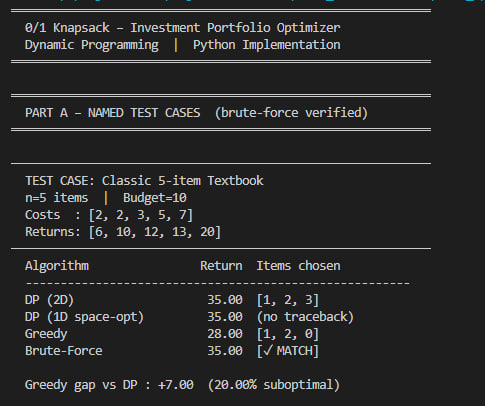
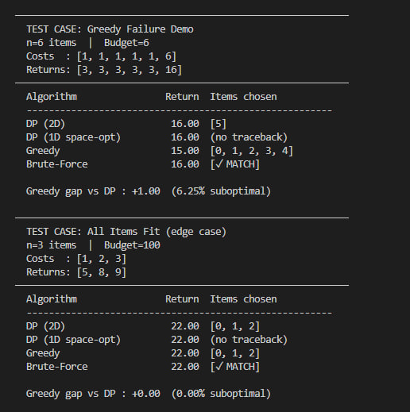
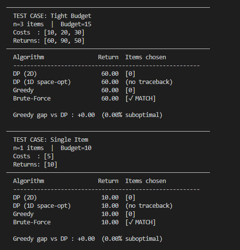
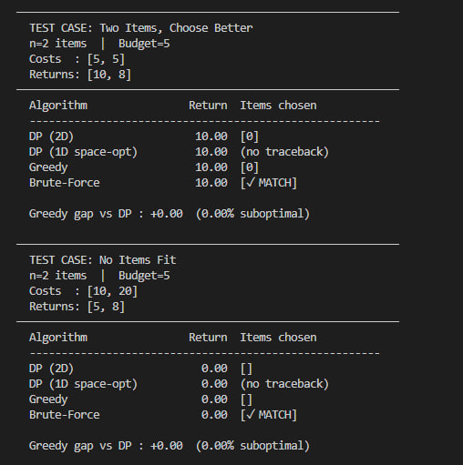
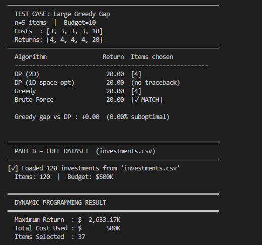
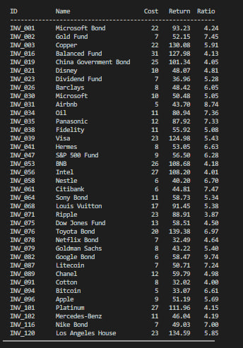
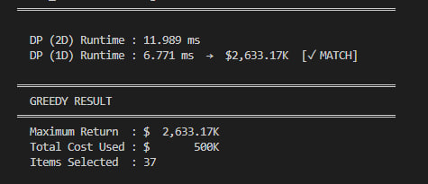
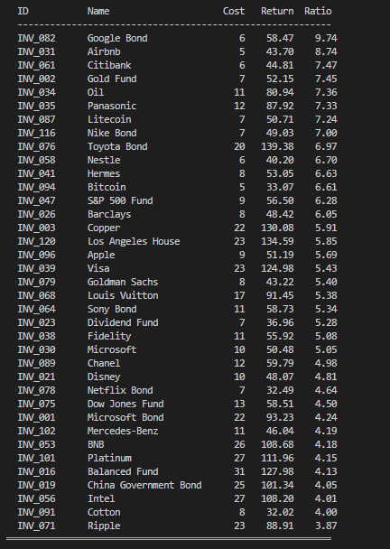
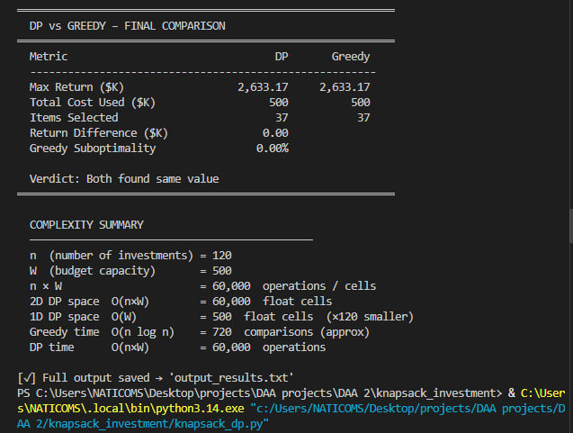

<div align="center">

# 💼 Investment Portfolio Optimizer
### 0/1 Knapsack — Dynamic Programming vs Greedy


> **Given $500,000 and 120 investment opportunities — find the exact combination that maximizes return.**

</div>

---

## 🧠 The Problem

An investor cannot partially buy a house or take half a bond position. Each opportunity is either **fully taken or skipped** — that's the 0/1 constraint.

| Knapsack Term | Investment Term | Description |
|---|---|---|
| Weight | Cost | Capital required ($1K units) |
| Value | Return | Expected profit |
| Capacity | Budget | $500,000 total |
| Item | Opportunity | Stock, bond, crypto, real estate... |

Brute force checks **2¹²⁰ ≈ 1.3 × 10³⁶** combinations — impossible. Dynamic Programming solves it in milliseconds.

---

## 📁 Project Structure

```
knapsack_investment/
├── 🐍 generate_dataset.py    → Creates investments.csv (120 items)
├── 🐍 knapsack_dp.py         → DP solver + greedy comparison
├── 📊 investments.csv        → 120 globally known investments
├── 📄 Report.pdf             → Full academic report
├── 📸 screenshoots/          → 9 program output screenshots
└── 📖 README.md              → You are here
```

---

## 🚀 How to Run

**Step 1 — Generate the dataset**
```bash
py generate_dataset.py
```

**Step 2 — Run the solver**
```bash
py knapsack_dp.py
```
> Output is automatically saved to `output_results.txt`

**Requirements:** Python 3.7+ · No external libraries (`csv`, `time`, `itertools` only)

---

## 📊 Results

### Part A — 8 Named Test Cases (brute-force verified)

| Test Case | DP | Greedy | Gap |
|---|---|---|---|
| Classic 5-item Textbook | 35.00 | 28.00 | ⚠️ 20% suboptimal |
| Greedy Failure Demo | 16.00 | 15.00 | ⚠️ 6.25% suboptimal |
| All Items Fit | 22.00 | 22.00 | ✅ 0% |
| Tight Budget | 60.00 | 60.00 | ✅ 0% |
| Single Item | 10.00 | 10.00 | ✅ 0% |
| Two Items, Choose Better | 10.00 | 10.00 | ✅ 0% |
| No Items Fit | 0.00 | 0.00 | ✅ 0% |
| Large Greedy Gap | 20.00 | 20.00 | ✅ 0% |

### Part B — Full 120-item Dataset ($500K budget)

```
╔══════════════════════════════════════════╗
║  Maximum Return  :  $2,633.17K           ║
║  Total Cost Used :  $500K  (full budget) ║
║  Items Selected  :  37 investments       ║
╠══════════════════════════════════════════╣
║  DP (2D) Runtime :  11.989 ms            ║
║  DP (1D) Runtime :   6.771 ms  ✓ MATCH  ║
╚══════════════════════════════════════════╝
```

---

## ⚡ Algorithm Comparison

| Algorithm | Time | Space | Optimal | Runtime |
|---|---|---|---|---|
| DP (2D) | O(n × W) | O(n × W) | ✅ Yes | 11.99 ms |
| DP (1D) | O(n × W) | O(W) | ✅ Yes | 6.77 ms |
| Greedy | O(n log n) | O(n) | ❌ No | < 1 ms |

> n = 120 investments · W = 500 ($500K budget) · n × W = 60,000 operations

---

## 📸 Screenshots

| # | Preview | Description |
|---|---|---|
| 1 |  | Classic test — DP=35, Greedy=28 (20% gap) |
| 2 |  | Greedy failure proof |
| 3 |  | Boundary conditions |
| 4 |  | Edge cases |
| 5 |  | Full dataset begins |
| 6 |  | All 37 DP picks |
| 7 |  | Runtime comparison |
| 8 |  | All 37 Greedy picks |
| 9 |  | Final comparison |

---

## 🏆 Key Result

> DP found the **optimal portfolio of $2,633,170 return** from 37 investments using exactly the full $500K budget.
> Greedy is proven **up to 20% suboptimal** on crafted inputs — even when it matches DP on this dataset, it is never guaranteed.

---

## 👥 Authors

<div align="center">

| Name | Student ID |
|---|---|
| Elias Araya | Aku1601720 |
| Mulu G/Medhin | Aku1602465 |
| Arsema Birhane | Aku1602222 |

**Aksum University · Design and Analysis of Algorithms (DAA) · April 2026**

</div>

---

<div align="center">

*This project is for educational purposes only.*

</div>
